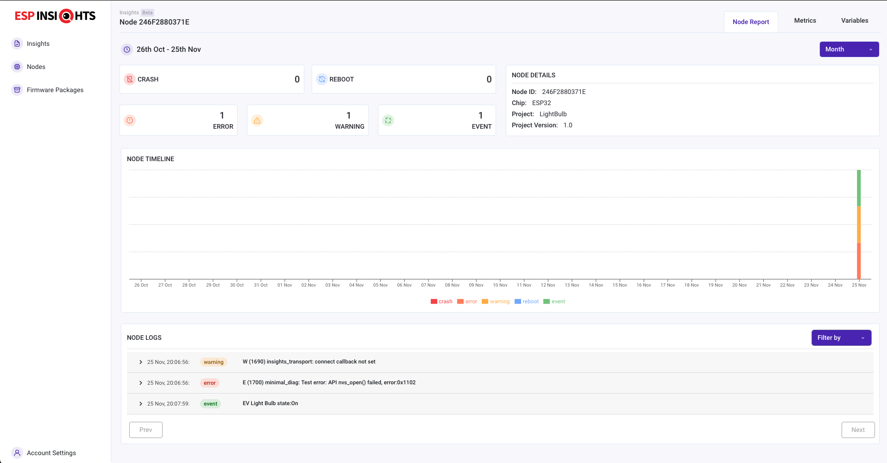

# ESP Insights (Beta)

ESP Insights is a remote diagnostics solution that allows users to remotely monitor the health of ESP devices in the field.

## Introduction

Developers normally prefer debugging issues by physically probing them using gdb or observing the logs. This surely helps debug issues, but there are often cases wherein issues are seen only in specific environments under specific conditions. Even things like casings and placement of the product can affect the behaviour. A few examples are

- Wi-Fi disconnections for a smart switch concealed in a wall.
- Smart speakers crashing during some specific usage pattern.
- Appliance frequently rebooting due to power supply issues.

Having remote diagnostics facility helps in identifying such issues faster. ESP Insights includes a firmware agent (the Insights agent) that captures some of the vital pieces of diagnostics information from the device during runtime and uploads them to the ESP Insights cloud. The cloud then processes this data for easy visualisation. Developers can log in to a web-based dashboard to look at the health and issues reported by their devices in the field. A sample screen is shown here.



Currently, developers can monitor the following information from the web-based dashboard:

- Error logs: Anything that is logged on console with calls with ESP_LOGE by any component in the firmware
- Warning logs: Anything that is logged on console with calls with ESP_LOGW by any component in the firmware
- Custom Events: Application specific custom events that the firmware wishes to track via calls to ESP_DIAG_EVENT
- Reset reason: The reason why the device was reset (power on, watchdog, brownout, etc.)
- Coredump summary: In case of a crash, the register contents as well as the stack backtrace of the offending thread (wherever possible)
- Metrics: Time-varying data like the free heap size, the Wi-Fi signal strength that is plotted over a period of time
- Variables: Variable values like the IP Address or state variables that report their current value
- Group analytics: Insights into how group of devices are performing

All of this information should help the developer understand better how their device is performing in the field.

You can find more details on [Insights Features](FEATURES.md) page.

> ESP Insights currently works with the ESP Insights cloud and ESP RainMaker cloud. Support for other cloud services will be available in a subsequent release.

## Getting Started
Following code should get you started, and your application can start reporting ESP Insights data to the Insights cloud.

### Enabling Insights with HTTPS
For Insights agent HTTPS is configure as the default transport.

```c
#include <esp_insights.h>
#define ESP_INSIGHTS_AUTH_KEY "<Paste-Auth-Key-Here>"

{
    esp_insights_config_t config  = {
        .log_type = ESP_DIAG_LOG_TYPE_ERROR,
        .auth_key = ESP_INSIGHTS_AUTH_KEY,
    };

    esp_insights_init(&config);

    /* Rest of the application initialization */
}
```

As you may have noticed, all you will need is the unique ESP_INSIGHTS_AUTH_KEY to be embedded in your firmware.
Here is how you can obtain the ESP Insights Auth Key:
* Sign up or Sign in on [ESP Insights Dashboard](https://dashboard.insights.espressif.com/)
* Visit [Manage Auth Keys](https://dashboard.insights.espressif.com/home/manage-auth-keys) and generate an Auth Key
* Copy the Auth Key to your firmware


### Enabling Insights with MQTT
Configure the default insights transport to MQTT (Component config → ESP Insights → Insights default transport → MQTT).
Alternately you can add `CONFIG_ESP_INSIGHTS_TRANSPORT_MQTT=y` to `sdkconfig.defaults`.

```c
#include <esp_insights.h>

{
    esp_insights_config_t config  = {
        .log_type = ESP_DIAG_LOG_TYPE_ERROR,
    };

    esp_insights_init(&config);

    /* Rest of the application initialization */
}
```
You will require the MQTT certs which you can obtain by performing [Claiming](examples/minimal_diagnostics#esp-insights-over-mqtt).

For more details please head over to [examples](examples).
